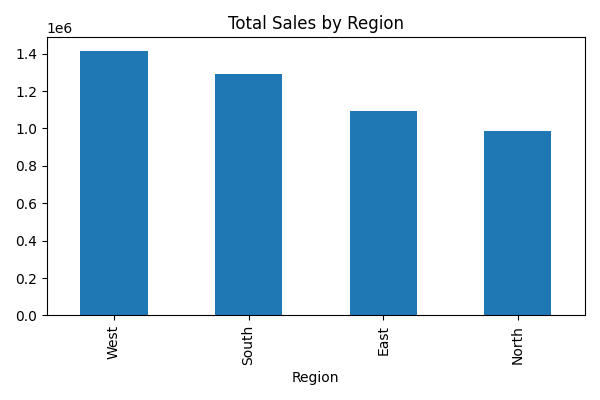

# 📊 BrightMart Sales Analysis Project

### 🔍 Overview
This project analyzes sales data for a fictional client, **BrightMart**, using **Python**, **Pandas**, and **Matplotlib**.
It automates insights generation and creates a **PDF report** with visual summaries.

---

### 🧠 Key Insights
- Regional sales performance (North, East, West, South)
- Product-level comparisons
- Average unit price & top-selling products
- Automated visualizations saved as `.png` charts
- PDF summary report generated automatically

---

### ⚙️ Tools & Libraries
| Category | Tools |
|-----------|-------|
| Programming | Python |
| Libraries | Pandas, Matplotlib, FPDF |
| Visualization | Charts & Automated Reports |
| IDE | PyCharm |
| Version Control | Git & GitHub |

---

### 📁 Project Structure

---

### 🧾 Sample Report
Here’s a sample of the generated report:


---

### 💼 About the Author
**Ans Bin Ahmed** — Freelance Data Analyst
- 🔹 Specializing in Python, Excel & Power BI
- 🔹 Turning data into insights and visual reports
- 🌍 Fiverr: [Click here to view my gig](https://www.fiverr.com/ans_bin_ahmad3)

---

### 🚀 How to Run
1. Clone this repository:
   ```bash
   git clone https://github.com/ans557789/brightmart-sales-analysis.git
